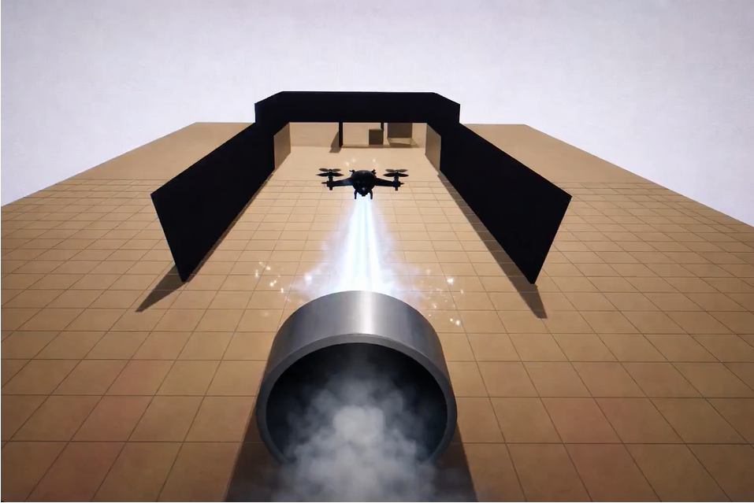
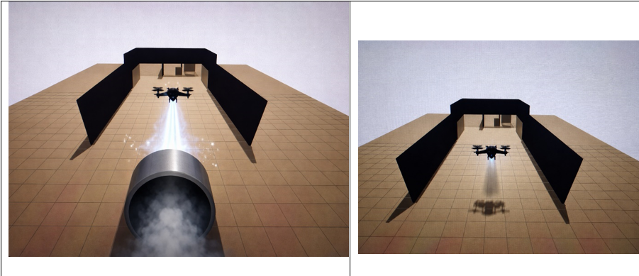
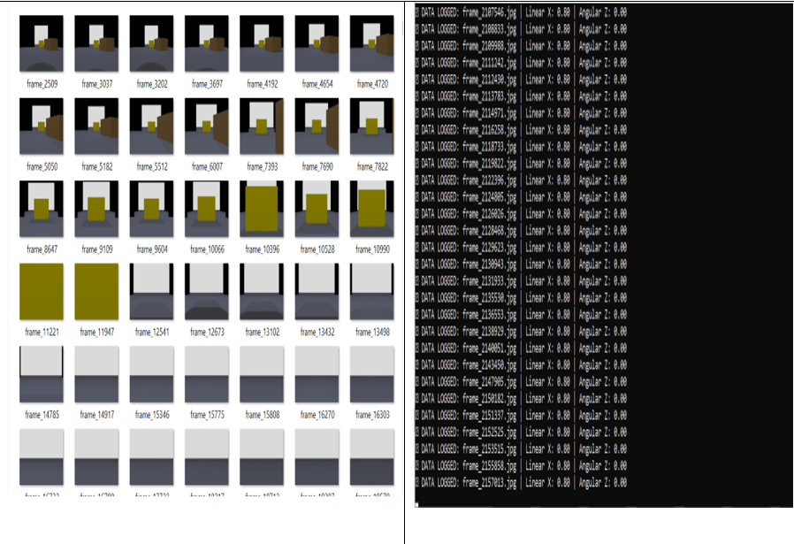
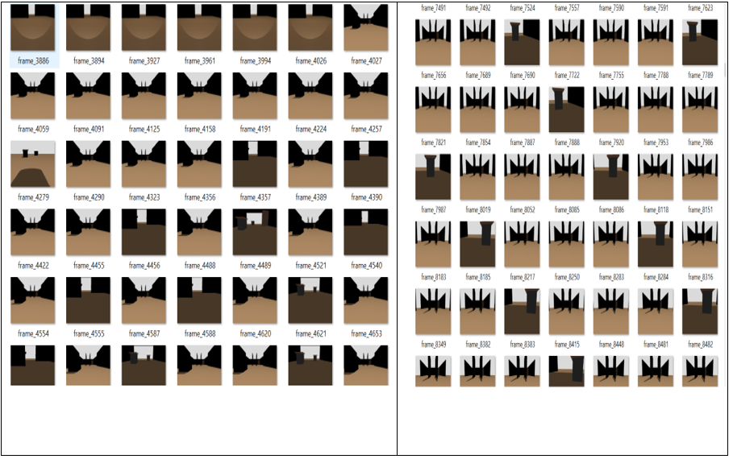
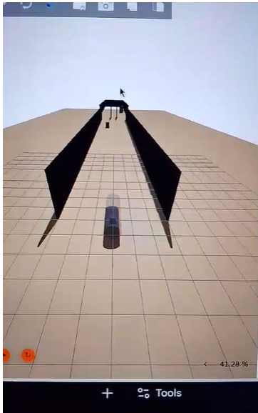
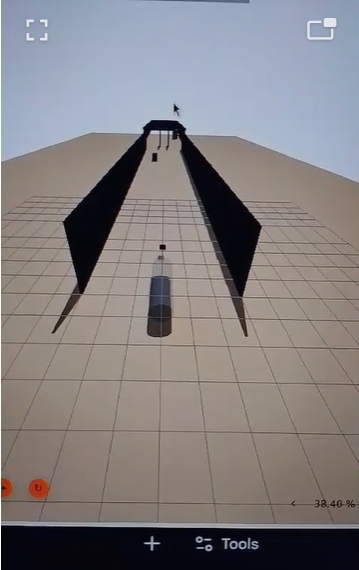
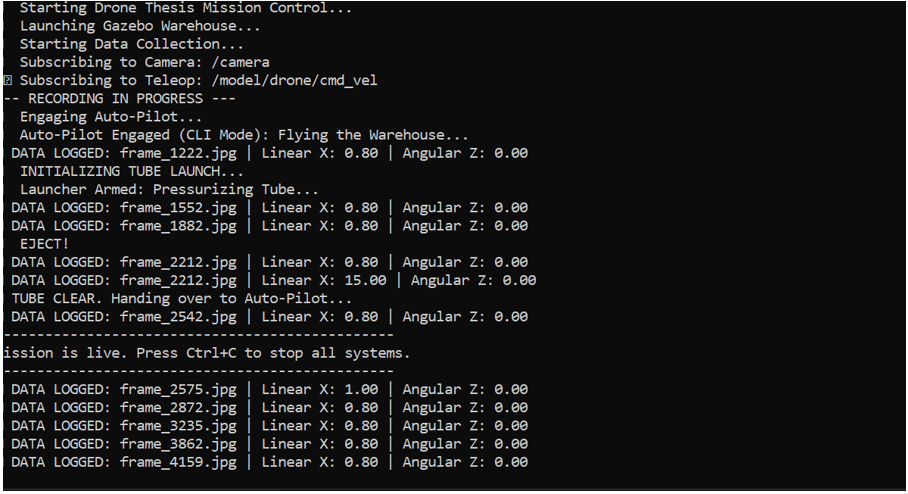
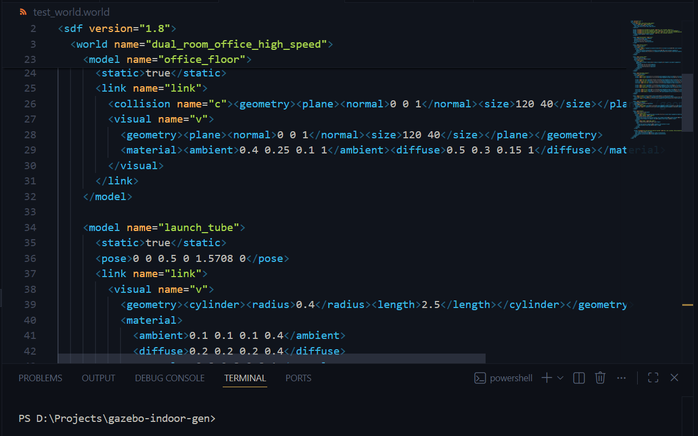

# gazebo-indoor-gen
### Procedural Indoor Environment Generation & Autonomous UAV Navigation via Imitation Learning

[](https://opensource.org/licenses/MIT)
[](http://wiki.ros.org/noetic)
[](https://docs.px4.io/main/en/simulation/sitl.html)

## 🚀 Overview
This repository provides a high-fidelity simulation framework for training autonomous drones to navigate complex indoor environments. By leveraging **Imitation Learning (IL)** and **Domain Randomization**, the system bridges the gap between expert-piloted data collection and fully autonomous obstacle avoidance.

---

## 📊 System Architecture
The following flowchart illustrates the expert-directed IL pipeline.

<p align="center">
  
</p>

---

## 🚁 Flight Mission Phases
The UAV operates under a dual-velocity constraint to test stability and precision.

| **Stage 1: Kinetic Launch** | **Stage 2: Autonomous Navigation** |
| :---: | :---: |
|  |  |
| **Velocity:** 15.0 m/s | **Velocity:** 5.5 m/s |
| **Duration:** 2.0s | **Control:** IL Inference |
| **Mechanism:** `launcher.py` | **Mechanism:** `auto_pilot.py` |

---

## 📥 Data Collection & Training
We utilize a synchronized pipeline to capture RGB camera frames and telemetry.

| **Collector Interface** | **Dataset Samples** |
| :---: | :---: |
|  |  |

---

## 🌎 Simulation Environments
We utilize domain randomization to train the UAV across various indoor layouts, ensuring robust obstacle avoidance.

| **Office Complex** | **Warehouse Logistics** |
| :---: | :---: |
|  |  |

---

## 💻 Implementation Details
<details>
<summary><b>Click to view core logic (Python & Bash)</b></summary>

| **Master Orchestration** | **Telemetry Processing** |
| :---: | :---: |
|  |  |

</details>

---

## 🛠️ Installation & Usage

### 1. Setup Environment
```bash
git clone [https://github.com/LawrenceOtieno/gazebo-indoor-gen.git](https://github.com/LawrenceOtieno/gazebo-indoor-gen.git)
cd gazebo-indoor-gen
./setup.sh

---

## 🛠️ Engineering & Development Workflow
This project served as a comprehensive application of robotics engineering and software best practices:

* **Python Scripting & System Integration:** Developed modular nodes to bridge PX4 telemetry with Imitation Learning inference engines, ensuring sub-millisecond data synchronization.
* **Automation:** Engineered bash-driven pipelines (`bash_02.PNG`) for procedural world generation, allowing for rapid dataset expansion via domain randomization.
* **Testing & Debugging:** Conducted extensive **Software-in-the-Loop (SITL)** testing to identify and resolve high-speed cornering instabilities and sensor-fusion lag during the kinetic launch phase.
* **Version Control & Repository Management:** Maintained a clean, documented Git workflow to manage complex dependencies across ROS, Gazebo, and the IL training pipeline.
# (End of your Installation code block)
./setup.sh