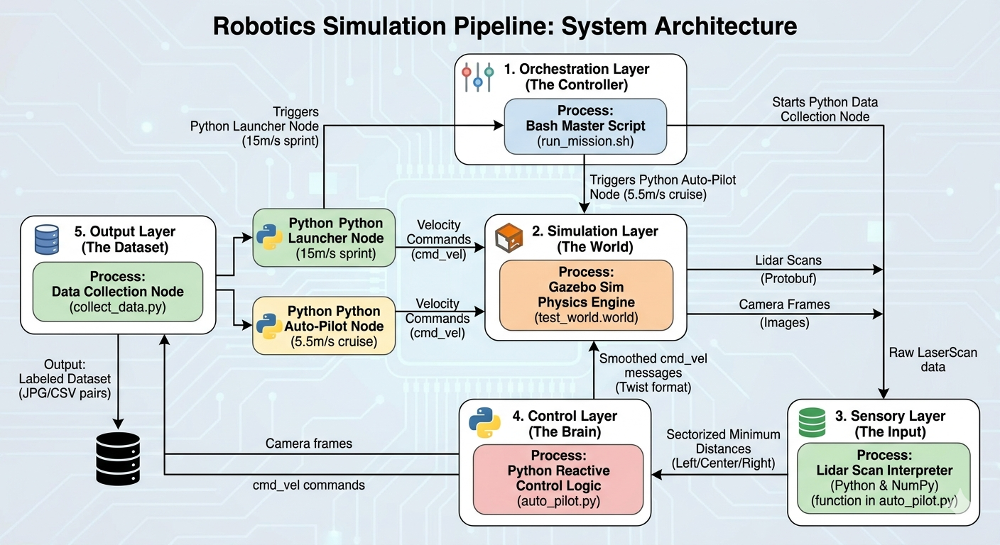

# gazebo-indoor-gen
### Procedural Indoor Environment Generation & Autonomous UAV Navigation via Imitation Learning

[](https://opensource.org/licenses/MIT)
[](http://wiki.ros.org/noetic)
[](https://docs.px4.io/main/en/simulation/sitl.html)

## 🚀 Overview
This repository provides a high-fidelity simulation framework for training autonomous drones to navigate complex indoor environments. By leveraging **Imitation Learning (IL)** and **Domain Randomization**, the system bridges the gap between expert-piloted data collection and fully autonomous obstacle avoidance.

---

## 📊 System Architecture
The following flowchart illustrates the expert-directed IL pipeline and the synchronization of camera feeds with control telemetry.

<p align="center">
  
</p>

---

## 🚁 Flight Mission Phases
The UAV operates under a dual-velocity constraint to test stability during high-speed transitions and precision during indoor navigation.

| **Stage 1: Kinetic Launch** | **Stage 2: Autonomous Navigation** |
| :---: | :---: |
|  |  |
| **Velocity:** 15.0 m/s | **Velocity:** 5.5 m/s |
| **Duration:** 2.0s | **Control:** IL Inference |
| **Mechanism:** `launcher.py` | **Mechanism:** `auto_pilot.py` |

---

## 📥 Data Collection & Training
We utilize a synchronized pipeline to capture RGB camera frames and mavlink control telemetry for the `drone_dataset`.

| **Collector Interface** | **Dataset Samples** |
| :---: | :---: |
|  |  |

---

## 🛠️ Installation & Usage

### 1. Prerequisites
* **ROS Noetic / Melodic**
* **Gazebo 11**
* **PX4 Autopilot (SITL)**
* Python 3.8+ (See `requirements.txt`)

### 2. Setup Environment
```bash
git clone [https://github.com/LawrenceOtieno/gazebo-indoor-gen.git](https://github.com/LawrenceOtieno/gazebo-indoor-gen.git)
cd gazebo-indoor-gen
chmod +x setup.sh run_mission.sh
./setup.sh